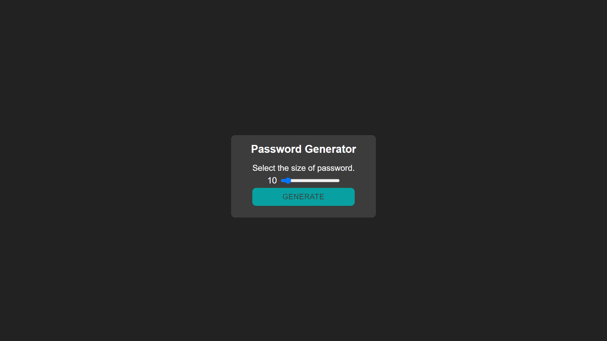
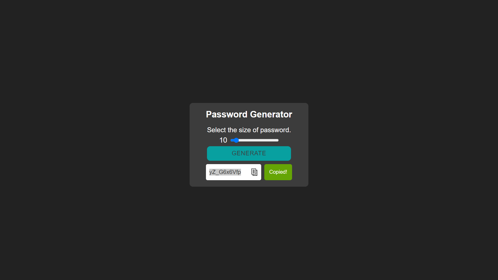

<!-- Título -->

<h1 align="center">Password Generator</h1>

<!-- Descrição -->

Gerador de senha, tendo a opção de escolher de 8 a 32 caractéres.

<!-- Súmario -->

 <a href="#rodando-a-aplicação">Rodando A Aplicação</a> •
 <a href="#tecnologias">Tecnologias</a> •
 <a href="#autor">Autor</a>

<!-- Site -->

<h2 align="center">Site</h2>

 <a href="https://matheuspalmieri.github.io/password-generator/">Site Do Projeto</a>

Gnerate Screen

 

Finish Screen

---

### Rodando A Aplicação

<a href="https://matheuspalmieri.github.io/password-generator/" target="_blank">Site do Projeto</a>

---

### Tecnologias

As seguintes ferramentas foram usadas na construção do projeto:

- [HTML](https://www.html.com/)
- [CSS](https://html.com/css/)
- [JavaScript](https://www.javascript.com/)

---

### Autor

Create for <b>`Matheus Palmieri`</b>👨‍💻

 
 

🎉Projeto Password Generator Finalizado🚀

